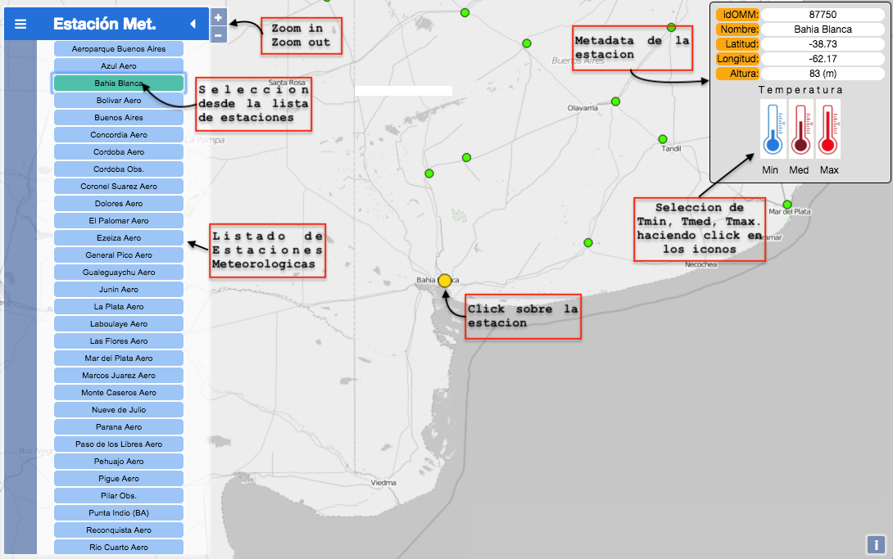
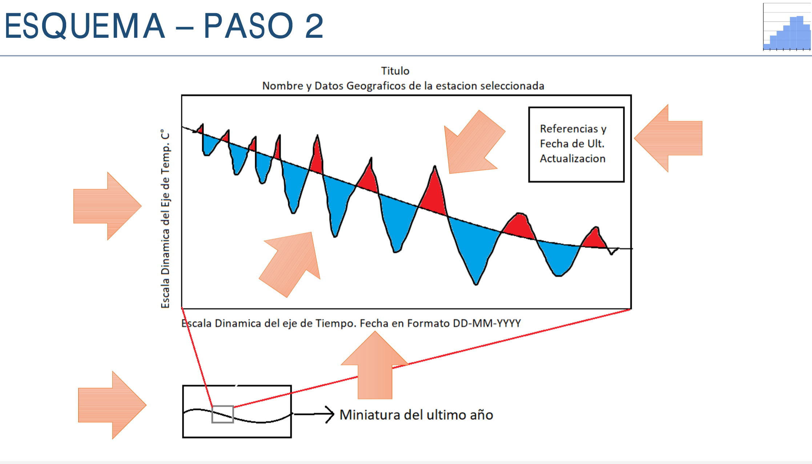
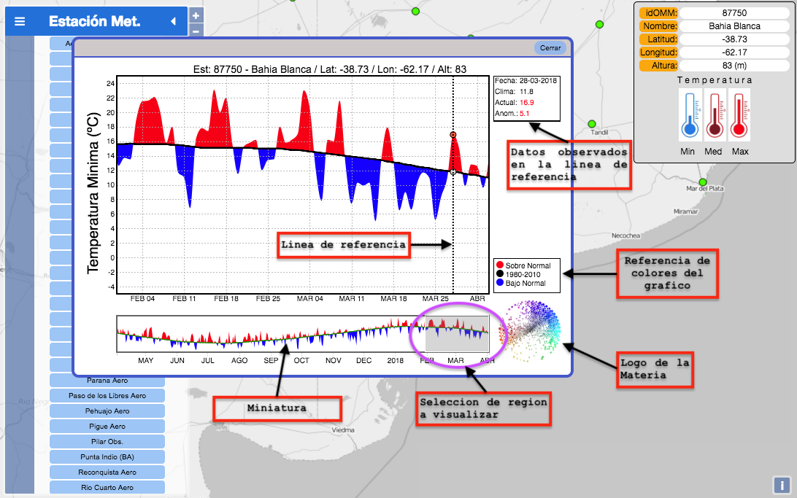

# VISUALIZACION DE LA INFORMACION 2018
## Trabajo Práctico 4 - Visualización de Temperaturas 
* Alfredo Luis Rolla 
* Juan Ignacio Mazza 

---
El objetivo del trabajo es llegar a tener una visualizacion en tiempo operacional, para mostrar series temporales de variables meteorologicas diarias como temperatura y precipitacion. En nuestro caso haremos solo la visualizacion de las temperaturas mínima, media y máxima.
***

La **primera parte** corresponde al mapa (usamos **openlayers**) y la seleccion de las estaciones sobre las que luego **mostramos en D3 la visualización de la temperatura mínima, media y máxima.**
Los datos estan en una base de datos MySQL, por eso usamos php para manejarnos con la base de datos.
Usando javascript y **ajax** , para generar objetos de tipo **json**, para luego ser usados por **D3**.

## Esquema de la base de datos

  

La **segunda parte** es la implementación mayormente en D3 de la visualización propuesta.

Breve descripción de los codigos escritos ( html, D3, php, javascript, openlayers, j-query):

 * **index.php**   : Codigo principal de la aplicación
 * **st_temp.php** : Codigo escrito principalmente usando **D3** para mostrar en modo dinámico las series temporales diarias de temperatura mínima, media y máxima. Pasando como parametros el ID de la estacion y la variable a mostrar (Tmin,Tmed,Tmax).
 * **serieT.php** : Recupera un objeto json de la base de datos MySQL. El objeto es una serie temporal diaria correspondiente a una estacion meteorologica que contiene los ultimos 365 datos de observaciones de la variable en analisis (Tmin,Tmed,Tmax) y 365 datos correspondientes a la media diaria de los ultimos 30 años (1981-2010) para esos dias. Usamos este periodo, por estandarización de la Organizacion Meteorologica Mundial. Y porque ya teniamos calculadas esas medias, ya que se usan filtros pasa bajos para que no sea muy ruidosa (Lanczos).
 * **estaciones** : Codigo que recupera la metadata de las estaciones
 

## Visualización propuesta Parte 1.

  

[Implementación del Paso 1](http://ciclon.cima.fcen.uba.ar/Visu2018/)

  

## Visualización propuesta Parte 2.

  

[Implementación del Paso 2](http://ciclon.cima.fcen.uba.ar/Visu2018/)

  

